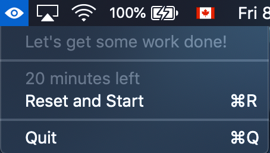

# HealthEye
> Swift app that helps users take a break from their screens.

HealthEye makes it easy for you to remind yourself to take a break when you're glued to your screen (as long as you're on MacOS 🙃). 

Using the 20-20-20 Rule, HealthEye reminds you to take a break every 20 minutes to look at something that's 20 feet away for 20 seconds.

